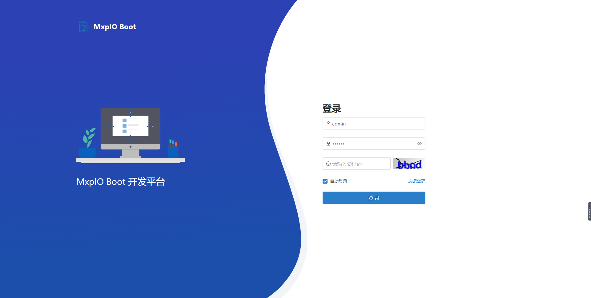
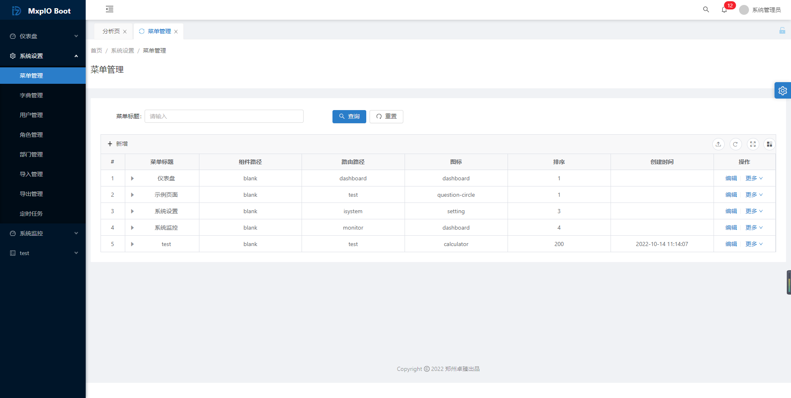
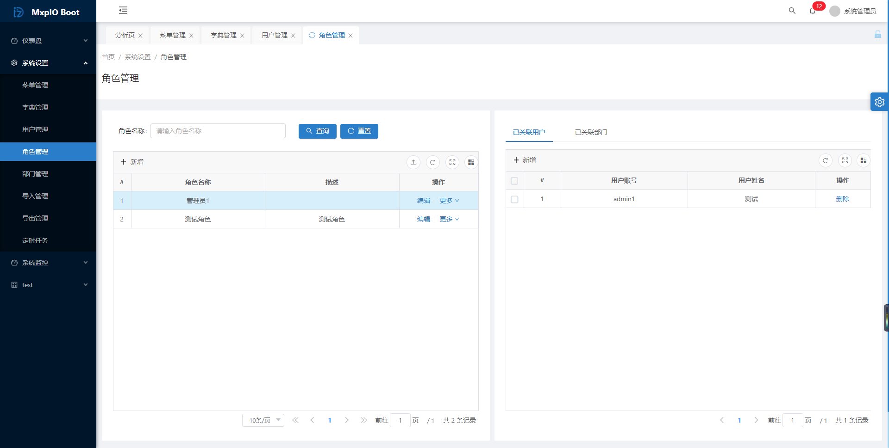
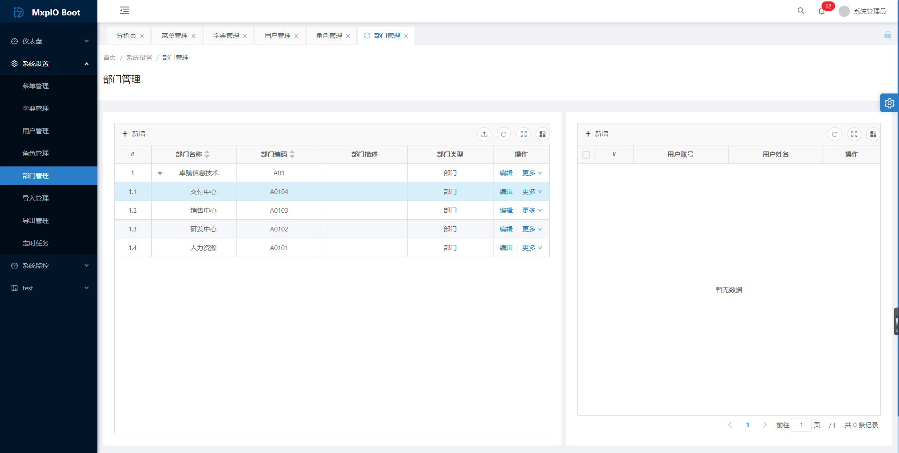
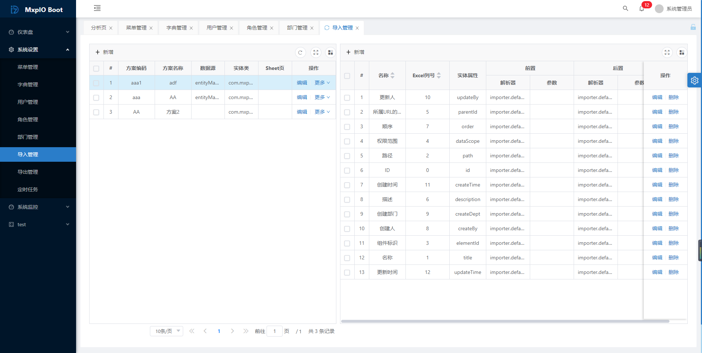
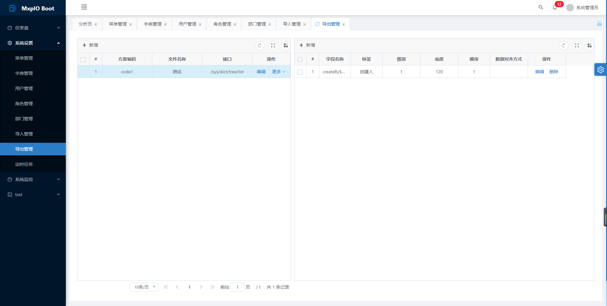
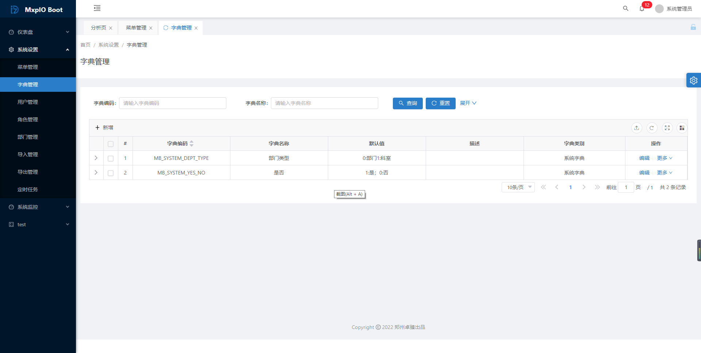
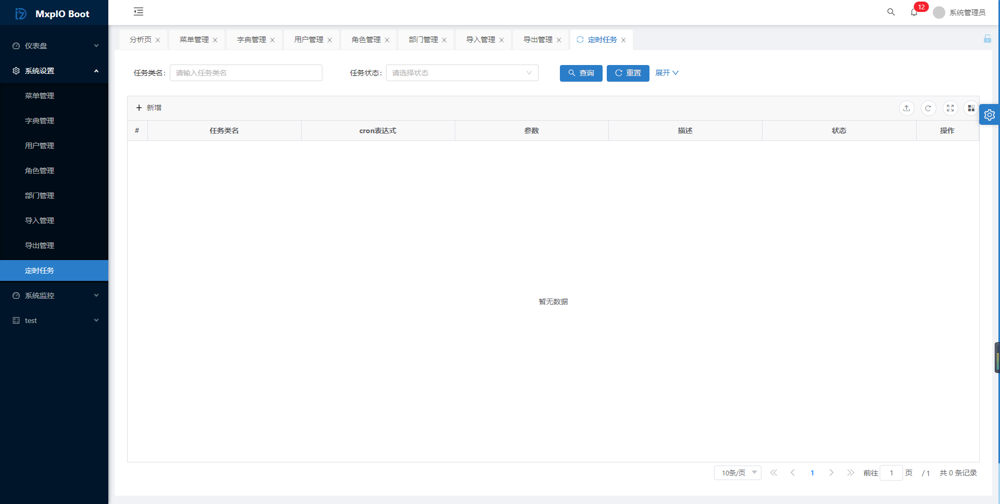

# MxpIO Boot

简体中文 | [English](./README.en.md)

> 基于 Spring Boot 4.0 的企业级低代码快速开发框架，整合了企业常用的功能及组件，开箱即用。

[](https://gitee.com/i_mxpio/mxpio-boot/blob/master/LICENSE)
[](https://gitee.com/i_mxpio/mxpio-boot)

---

## 1. 技术栈

### 后端

| 技术 | 版本/说明 |
|------|----------|
| JDK | 25 |
| Spring Boot | 4.0.1 |
| Spring Data JPA | Hibernate 方言，支持 MySQL / 达梦 / 人大金仓 / GaussDB |
| Spring Security | Lambda DSL，OAuth2 Resource Server |
| Spring Cache | Caffeine 本地缓存 / Redis 分布式缓存 |
| Camunda | 7.24.0 工作流引擎 |
| Quartz | JDBC 持久化定时任务 |
| Apache POI | 5.5.1 Excel 导入导出 |
| Aviator | 4.2.7 表达式引擎 |
| MinIO | 8.6.0 文件存储 |
| Druid | 1.2.27 数据库连接池 |
| SpringDoc | 3.0.2 + Knife4j 3.0.3 API 文档 |
| Lombok | 1.18.42 |

### 中间件

- **数据库：** MySQL 8.0+（兼容达梦 DM8、人大金仓 Kingbase V8、南大通用 GaussDB）
- **缓存：** Redis 7.x

### 前端

基于 [Vue Vben Admin](https://github.com/vbenjs/vue-vben-admin) monorepo 架构：

- Vue 3 + TypeScript + Vite
- UnoCSS / Ant Design Vue
- pnpm + TurboRepo monorepo
- 内置业务模块：系统管理、库存、采购、销售、质量、设备、计划等

---

## 2. 模块结构

```
mxpio-boot/
├── pom.xml                            ← 根 POM
├── mxpio-dependencies/                ← BOM 统一版本管理
├── mxpio-framework/                   ← 核心框架层
│   ├── mxpio-autoconfigure/           ← 自动装配中心
│   ├── mxpio-common/                  ← 公共工具、全局异常处理
│   ├── mxpio-jpa/                     ← JPA 增强（Linq 风格查询）
│   ├── mxpio-cache/                   ← 缓存抽象接口
│   ├── mxpio-cache-redis/             ← Redis 缓存实现
│   ├── mxpio-cache-caffeine/          ← Caffeine 本地缓存
│   ├── mxpio-security/                ← RBAC 权限体系（URL/按钮/数据权限）
│   ├── mxpio-system/                  ← 系统管理（部门、角色、用户、菜单、字典等）
│   ├── mxpio-quartz/                  ← Quartz 定时任务管理
│   ├── mxpio-camunda/                 ← Camunda 工作流适配
│   ├── mxpio-log/                     ← 操作日志审计
│   ├── mxpio-expression/              ← Aviator 表达式引擎
│   ├── mxpio-filestorage/             ← 文件存储（MinIO / 本地）
│   ├── mxpio-multitenant/             ← 多租户支持
│   ├── mxpio-dbconsole/               ← 云数据库控制台
│   ├── mxpio-message/                 ← 消息通知中心
│   ├── mxpio-websocket/               ← WebSocket 实时推送
│   ├── mxpio-excel/                   ← Excel 导入导出
│   └── mxpio-datav/                   ← 数据可视化大屏
├── mxpio-boot-modules/                ← 第三方集成层
│   ├── mxpio-dingtalk/                ← 钉钉集成
│   ├── mxpio-wechat/                  ← 企业微信集成
│   ├── mxpio-email/                   ← 邮件发送
│   ├── mxpio-msal/                    ← Microsoft 身份认证
│   └── mxpio-oauth/                   ← OAuth2 客户端
├── mxpio-ui/                     ← 前端 monorepo
└── examples/                          ← 示例工程（非 Maven 模块）
    └── mxpio-boot-example/
```

### 分层构建

```bash
# 只构建框架层
mvn -pl mxpio-framework clean install -DskipTests

# 只构建功能模块层
mvn -pl mxpio-boot-modules clean install -DskipTests

# 全量构建
mvn clean install -DskipTests
```

---

## 3. 快速开始

### 环境要求

| 组件 | 版本要求 |
|------|---------|
| JDK | 25 |
| Maven | 3.8+ |
| MySQL | 8.0+ |
| Redis | 7.x |

### 3.1 源码启动

```bash
# 克隆项目
git clone https://gitee.com/i_mxpio/mxpio-boot.git
cd mxpio-boot

# 创建数据库
# 登录 MySQL 执行：CREATE DATABASE IF NOT EXISTS `mboot` DEFAULT CHARACTER SET utf8mb4 COLLATE utf8mb4_unicode_ci;

# 修改配置（数据库密码等）
# 编辑 examples/mxpio-boot-example/src/main/resources/application-dev.yml

# 编译框架并启动示例工程
mvn clean install -DskipTests
cd examples/mxpio-boot-example && mvn spring-boot:run
```

启动后访问：
- 应用地址：`http://localhost:9005`
- API 文档：`http://localhost:9005/swagger-ui.html`
- 默认账户：`admin` / `123456`（首次启动自动创建）

### 3.2 作为依赖引入

在你的 Spring Boot 项目中继承 `mxpio-boot-parent`，然后按需引入模块：

```xml
<parent>
    <groupId>com.mxpio</groupId>
    <artifactId>mxpio-boot-parent</artifactId>
    <version>4.0.0-beta.2</version>
</parent>

<dependencies>
    <!-- 自动装配（必选） -->
    <dependency>
        <groupId>com.mxpio</groupId>
        <artifactId>mxpio-autoconfigure</artifactId>
    </dependency>
    <!-- 按需引入功能模块 -->
    <dependency>
        <groupId>com.mxpio</groupId>
        <artifactId>mxpio-security</artifactId>
    </dependency>
    <dependency>
        <groupId>com.mxpio</groupId>
        <artifactId>mxpio-system</artifactId>
    </dependency>
    <dependency>
        <groupId>com.mxpio</groupId>
        <artifactId>mxpio-cache-caffeine</artifactId>
    </dependency>
    <dependency>
        <groupId>com.mxpio</groupId>
        <artifactId>mxpio-excel</artifactId>
    </dependency>
    <dependency>
        <groupId>com.mxpio</groupId>
        <artifactId>mxpio-quartz</artifactId>
    </dependency>
    <dependency>
        <groupId>com.mxpio</groupId>
        <artifactId>mxpio-camunda</artifactId>
    </dependency>
</dependencies>
```

### 3.3 配置文件示例

```yaml
server:
  port: 9005

spring:
  datasource:
    url: jdbc:mysql://localhost:3306/mboot?characterEncoding=utf-8&useSSL=true&nullCatalogMeansCurrent=true
    username: root
    password: your-password
    driver-class-name: com.mysql.cj.jdbc.Driver
  jpa:
    hibernate:
      ddl-auto: update
    show-sql: true
  redis:
    host: 127.0.0.1
    port: 6379
  sql:
    init:
      mode: always
      platform: mysql
      data-locations: classpath*:data-${spring.sql.init.platform}.sql,classpath*:data.sql
  quartz:
    job-store-type: jdbc

camunda:
  bpm:
    database:
      type: mysql
      schema-update: true
```

---

## 4. 配置体系

MxpIO Boot 采用**模块级默认 + 应用级覆盖**的配置机制：

```
应用级 mxpio.properties   ← 最高优先级（覆盖模块默认值）
        ↓
模块级 mxpio.properties   ← 各模块自带默认配置
        ↓
application.yml          ← Spring Boot 标准配置
```

每个模块在 `src/main/resources/mxpio/mxpio.properties` 中声明默认值，应用工程可以在自己的 `mxpio.properties` 中按需覆盖。

---

## 5. 核心特性

- **自动装配** — `mxpio-autoconfigure` 基于 Spring Boot 条件注解，按类路径自动装配模块
- **RBAC 权限** — URL 权限 / 按钮权限 / 数据权限三级控制，支持 JWT Token
- **Linq 查询** — `mxpio-jpa` 提供类似 C# Linq 风格的 JPA 查询封装
- **多租户** — 独立数据库隔离，动态数据源切换
- **工作流** — Camunda 7.x 深度集成，流程设计 + 任务管理
- **代码生成** — 基于实体类自动生成 Controller / Service / Repository
- **文件管理** — 抽象存储层，支持本地 / MinIO，可扩展 OSS 等
- **消息中心** — 统一消息推送接口，支持站内信、WebSocket、邮件、钉钉、企微
- **表达式引擎** — Aviator 表达式，用于业务规则配置
- **定时任务** — Quartz JDBC 持久化，支持集群调度
- **数据大屏** — 内置数据可视化配置（mxpio-datav）

---

## 6. 在线文档

详细开发文档见 `docs/` 目录，或访问 [https://mxpio.com/](https://mxpio.com/)

---

## 7. 使用登记

以下公司正在使用此框架：

- **河南人才集团** — [http://www.hn-talent.com/](http://www.hn-talent.com/)
- **郑州卓臻信息技术有限公司** — [https://www.datazhzh.com/](https://www.datazhzh.com/)
- **山东禾美网络科技有限公司** — [http://www.unidbg.cn/](http://www.unidbg.cn/)

如果你的公司也在使用，欢迎通过 Issue 联系我们。

---

## 8. 截图

| 登录 | 菜单管理 |
|------|---------|
|  |  |

| 角色管理 | 部门管理 |
|------|---------|
|  |  |

| 导入管理 | 导出管理 |
|------|---------|
|  |  |

| 数据字典 | 任务调度 |
|------|---------|
|  |  |

---

## 9. License

[MIT License](https://gitee.com/i_mxpio/mxpio-boot/blob/master/LICENSE)

感谢 [JetBrains](https://www.jetbrains.com/) 提供的 IDE 授权。
